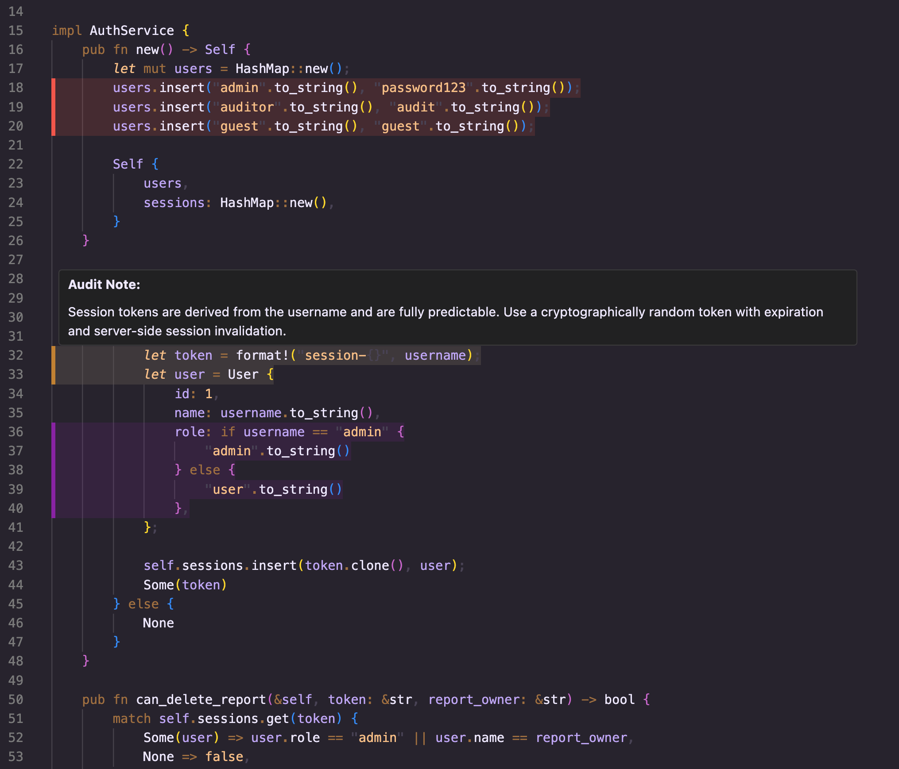
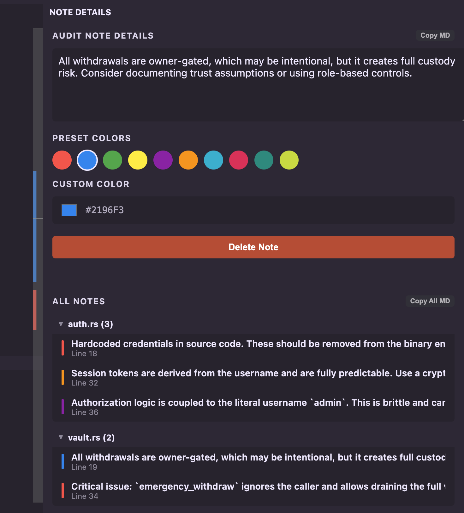

# AuditNotes

AuditNotes lets you attach notes to selected code in VS Code. It is meant for audits, reviews, and general code investigation where you want to keep local notes without editing the source itself.

## Features

- Add a note to any selected code range.
- Highlight ranges with colors.
- View and edit notes in the sidebar.
- Preview notes on hover.
- Copy one note or all notes as Markdown.
- Keep notes locally in the workspace.

## Screenshots

### Notes Sidebar

### Context Menu

## Usage

1. Select some code in the editor.
2. Right-click and run `Add Audit Note`.
3. Enter the note text in the Audit Notes sidebar.
4. Pick a color if you want.
5. Hover highlighted code or use the sidebar to revisit notes.
6. Use `Copy MD` or `Copy All MD` to export notes.

## Extension Settings

This extension adds one setting:

- `auditnotes.defaultColor`: Default background color used for new audit notes.

## Storage

Notes are stored in a workspace-root file named `.audit-notes.json`.

- This file stays local to the project.
- If you do not want review notes committed, keep `.audit-notes.json` in `.gitignore`.

## Requirements

No external service, account, or API key is required.

## Limitations

- Notes are tied to file paths and saved line ranges in the current workspace.
- Large code edits, file moves, or file renames may require note cleanup or recreation.

## Release Notes

### 0.0.1

Initial public release of AuditNotes with sidebar note management, inline highlights, hover previews, and Markdown export.

## License

MIT

## Disclaimer

This extension was vibecoded and may contain bugs, rough edges, or broken behavior.

If you hit an issue or have an idea for improvement, please open an issue on GitHub:

https://github.com/hyckomatej/auditnotes/issues

